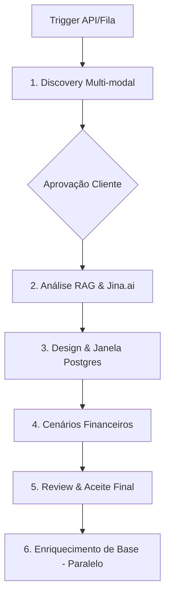

## 🏗️ Arquitetura do Sistema (MVP1)

O **Estimator** opera em um processo **Sequencial** de 5 fases, com um agente de memória (Agente 6) atuando em paralelo na fase final.

### Fluxo de Dados (MVP1 Pipeline)

---

## 🤖 Os Agentes (MVP1 Crew)

### 1. Software Architecture Interviewer
- **Especialidade**: Solution Architect.
- **Missão**: Entrevista multi-modal (Texto, Imagem, Som, Vídeo) via checklists Postgres.
- **Ferramentas**: `Gemini 2.0 (Nativo)`, `FileRead`, `OCR`, `MindsDB`, `ScrapeWebsite`.

### 2. Technical Research Analyst
- **Especialidade**: Especialista em Recuperação Documental & Discovery.
- **Missão**: Validação via RAG Multi-tenant e histórico no **Postgres (JSONB)**. Utiliza o **Jina.ai Reader** para leitura otimizada de documentações oficiais na web.
- **Ferramentas**: `Qdrant`, `Serper (Search)`, `Jina Reader`, `MindsDB`.

### 3. Software Architect
- **Especialidade**: Designer & Consolidador.
- **Missão**: Transforma RAG e Discovery em design final. Persiste tudo no Postgres para relatórios.

### 4. Cost Optimization Specialist
- **Especialidade**: FinOps.
- **Missão**: Gera 3 cenários (Humano, IA, Híbrido) e análise de riscos.

### 5. Reviewer & Presenter
- **Especialidade**: Conciliador Técnico-Funcional.
- **Missão**: Apresentação final e feedback loop de aceite.

### 6. Knowledge Management Specialist
- **Especialidade**: Guardião da Memória Institucional.
- **Missão**: Executa em paralelo com a fase 5 para garantir que o resultado final seja indexado no Qdrant para futuros RAGs.

---

## 🛠️ Stack Tecnológica (MVP1)

| Componente | Tecnologia | Papel |
| :--- | :--- | :--- |
| **Orquestração** | CrewAI v1.10.1 | Fluxo de Agentes |
| **LLM / Mídias** | **Gemini 2.0 Flash** | Processamento de Texto, Áudio e Vídeo |
| **Relational & NoSQL**| **PostgreSQL (JSONB)** | Checklists, Histórico e Padrões (Subst. Firebase) |
| **Web Reading** | **Jina.ai Reader** | Leitura de Docs Oficiais para o Analista |
| **Vector DB** | Qdrant | Memória RAG (Team/User/Project) |
| **AI Memory** | MindsDB | Sincronismo entre agentes |
| **API Trigger** | FastAPI + Redis/Queue | Orquestração de entrada |

---

## � Infraestrutura & Deployment (POC)

Para a fase de POC, toda a stack de **Staging** e **Produção** será instalada em uma **VM Dedicada** (On-premises ou Cloud VM), permitindo controle total das ferramentas.

### Arquitetura de Hosting (Self-hosted)
Utilizaremos **Docker Compose** para orquestrar todos os serviços localmente na VM, garantindo portabilidade e facilidade de manutenção:
*   **PostgreSQL**: Base de dados única para Relacional e Documental (JSONB).
*   **MindsDB**: Servidor de IA local para sincronismo e memória.
*   **Qdrant**: Engine de busca vetorial local.
*   **Redis**: Sistema de gerenciamento de filas para a API.
*   **Jina Utility**: Ferramentas de suporte local para leitura de logs.

### Acesso Externo
*   **Gemini 2.0 Flash**: O processamento de LLM e multi-modalidade será feito via **API na Internet** (Google Cloud AI Services). Esta é a única saída de rede necessária para o funcionamento da inteligência central.

---

