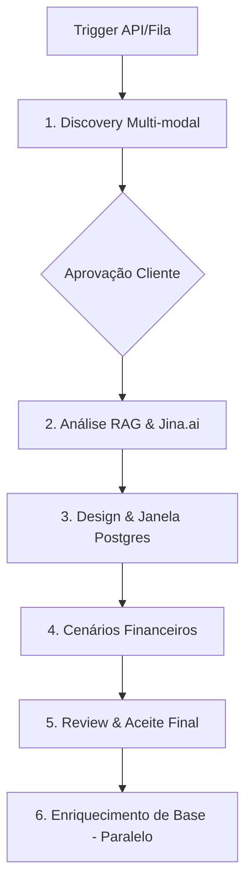

# 📚 oute-mind Technical Deep Wiki

**Complete technical documentation of oute-mind software project estimation system**

---

## 🎯 Project Overview

**oute-mind** is a CrewAI-powered multi-agent system that provides comprehensive software project estimations by analyzing requirements through a 6-agent sequential pipeline. The system uses advanced RAG (Retrieval-Augmented Generation), vector databases, and financial modeling to generate three distinct cost scenarios (human-only, AI-only, hybrid) with detailed risk assessments.

The system is designed for:
- **Software Development Companies** - Accurate project bidding and resource planning
- **Consultancies** - Professional estimation reports for clients
- **Enterprise IT** - Internal project cost forecasting and scenario modeling

---

## 🔬 Core Technologies

| Component | Technology | Version | Purpose |
|-----------|-----------|---------|---------|
| **Orchestration** | CrewAI | v1.10.1 | Multi-agent framework with task management |
| **LLM** | Google Gemini | 1.5 Flash | Multimodal AI processing (text, images, audio, video) |
| **Vector Database** | Qdrant | Latest | RAG indexing + semantic search for knowledge base |
| **Relational DB** | PostgreSQL | v16 | Project data, estimation history, framework patterns (JSONB) |
| **Memory System** | MindsDB | Latest | Agent synchronization and state management |
| **Cache/Queue** | Redis | v7 | Session caching, async task queuing |
| **Web Scraping** | Jina Reader | Cloud API | Documentation extraction (r.jina.ai) |
| **API** | FastAPI | Latest | REST endpoints with async support |
| **Reverse Proxy** | Caddy | Latest | HTTP/2, auto TLS, load balancing |
| **Containers** | Docker + Compose | v2+ | Multi-arch deployment (ARM + Intel) |
| **Monitoring** | Prometheus + Grafana | Latest | Metrics collection and visualization |
| **CI/CD** | GitHub Actions | - | Automated testing and deployment |
| **Infrastructure** | GCP Compute Engine | - | Cloud hosting (t2a ARM VMs) |

---

## 🏗️ Arquitetura do Sistema (MVP1)

O **Estimator** opera em um processo **Sequencial** de 5 fases, com um agente de memória (Agente 6) atuando em paralelo na fase final.

### Fluxo de Dados (MVP1 Pipeline)


---

## 🤖 Os Agentes (MVP1 Crew)

### 1. Software Architecture Interviewer
- **Especialidade**: Solution Architect.
- **Missão**: Entrevista multi-modal (Texto, Imagem, Som, Vídeo) via checklists Postgres.
- **Ferramentas**: `Gemini 1.5 (Nativo)`, `FileRead`, `OCR`, `MindsDB`, `ScrapeWebsite`.

### 2. Technical Research Analyst
- **Especialidade**: Especialista em Recuperação Documental & Discovery.
- **Missão**: Validação via RAG Multi-tenant e histórico no **Postgres (JSONB)**. Utiliza o **Jina.ai Reader** para leitura otimizada de documentações oficiais na web.
- **Ferramentas**: `Qdrant`, `Serper (Search)`, `Jina Reader`, `MindsDB`.

### 3. Software Architect
- **Especialidade**: Designer & Consolidador.
- **Missão**: Transforma RAG e Discovery em design final. Persiste tudo no Postgres para relatórios.

### 4. Cost Optimization Specialist
- **Especialidade**: FinOps.
- **Missão**: Gera 3 cenários (Humano, IA, Híbrido) e análise de riscos.

### 5. Reviewer & Presenter
- **Especialidade**: Conciliador Técnico-Funcional.
- **Missão**: Apresentação final e feedback loop de aceite.

### 6. Knowledge Management Specialist
- **Especialidade**: Guardião da Memória Institucional.
- **Missão**: Executa em paralelo com a fase 5 para garantir que o resultado final seja indexado no Qdrant para futuros RAGs.

---

## 🛠️ Stack Tecnológica (MVP1)

| Componente | Tecnologia | Papel |
| :--- | :--- | :--- |
| **Orquestração** | CrewAI v1.10.1 | Fluxo de Agentes |
| **LLM / Mídias** | **Gemini 1.5 Flash** | Processamento de Texto, Áudio e Vídeo |
| **Relational & NoSQL**| **PostgreSQL (JSONB)** | Checklists, Histórico e Padrões (Subst. Firebase) |
| **Web Reading** | **Jina.ai Reader** | Leitura de Docs Oficiais para o Analista |
| **Vector DB** | Qdrant | Memória RAG (Team/User/Project) |
| **Vector DB** | Qdrant | Memória RAG (Team/User/Project) |
| **AI Memory** | MindsDB (AIMindTool) | Sincronismo entre agentes |
| **API Trigger** | FastAPI + Redis/Queue | Orquestração de entrada |

---

## ⚡ Gatilhos & Orquestração (Trigger Mechanism)

O sistema foi desenhado para ser resiliente e escalável, utilizando uma arquitetura orientada a eventos para o disparo da Crew.

1.  **FastAPI Entrypoint**: O frontend envia uma requisição para o endpoint `/kickoff`.
2.  **Redis Queue**: A tarefa é enfileirada no Redis para processamento asíncrono.
3.  **Processamento Background**: Um worker especializado (ex: Celery ou RQ) instasia a Crew e inicia a execução.
4.  **Webhooks/Status**: O progresso é persistido no Postgres, permitindo que o frontend consulte o status em tempo real via `/status/{id}`.

### 🎥 Processamento Multi-modal (Gemini 1.5 Flash)

O **Agente 1 (Solution Architect)** utiliza as capacidades nativas do Gemini 1.5 para processar:
*   **Imagens**: Diagramas de arquitetura, fluxogramas em guardanapo ou prints de sistemas legados.
*   **Áudio**: Gravações de reuniões de discovery ou áudios de WhatsApp/Telegram com requisitos.
*   **Vídeo**: Walkthroughs de sistemas atuais ou explicações gravadas de fluxos de negócio.
*   **Documentos**: PDFs, DOCX e Planilhas complexas.

---

## � Infraestrutura & Deployment (POC)

Para a fase de POC, toda a stack de **Staging** e **Produção** será instalada em uma **VM Dedicada** (On-premises ou Cloud VM), permitindo controle total das ferramentas.

### Arquitetura de Hosting (Self-hosted)
Utilizaremos **Docker Compose** para orquestrar todos os serviços localmente na VM, garantindo portabilidade e facilidade de manutenção:
*   **PostgreSQL**: Base de dados única para Relacional e Documental (JSONB).
*   **MindsDB**: Servidor de IA local para sincronismo e memória.
*   **Qdrant**: Engine de busca vetorial local.
*   **Redis**: Sistema de gerenciamento de filas para a API.
*   **Jina Reader**: Cloud API (r.jina.ai) para leitura otimizada de documentação web.

### Acesso Externo
*   **Gemini 1.5 Flash**: O processamento de LLM e multi-modalidade será feito via **API na Internet** (Google Cloud AI Services). Esta é a única saída de rede necessária para o funcionamento da inteligência central.

---

## 🔌 API Endpoints & Integration Points

### Health Check Endpoint
```
GET /health
Response: {"status": "healthy", "service": "software-estimator"}
```

### Status Endpoint
```
GET /api/status
Response: {"status": "running", "version": "1.0.0", "crew_status": "ready"}
```

### Estimation Endpoint (Main)
```
POST /estimate
Request: {"estimation_id": "proj-001", "project_details": "..."}
Response: {"estimation_id": "proj-001", "result": "...", "status": "success"}
```

---

## ⚙️ Configuration Reference

### LLM Settings
```bash
MODEL=google/gemini-1.5-flash      # LLM model
LLM_TEMPERATURE=0.7                # Creativity level (0.0-1.0)
```

### Database Connections
```bash
POSTGRES_HOST=postgres
POSTGRES_USER=oute_prod_user
REDIS_HOST=redis
QDRANT_HOST=qdrant
MINDSDB_HOST=mindsdb
```

### API Keys
```bash
GOOGLE_API_KEY=sk-...              # Required
SERPER_API_KEY=...                 # Optional (web search)
COMPOSIO_API_KEY=...               # Optional (integrations)
OPENAI_API_KEY=...                 # Required by CrewAI/LiteLLM
```

---

## 📊 Data Flow Pipeline

### Request Processing
```
1. Client POST /estimate
2. FastAPI validates schema
3. Crew initialization (lazy load)
4. Sequential agent execution (1-5)
5. Parallel knowledge enrichment (6)
6. Result serialized to JSON
7. Data persisted in PostgreSQL
```

### Data Storage
```
PostgreSQL:
├── estimation_requests
├── estimation_findings
├── estimation_costs (3 scenarios)
├── estimation_risks
└── historical_patterns

Qdrant:
├── project_patterns
├── technical_patterns
├── cost_history
└── knowledge_base
```

---

## 🚀 Performance Benchmarks

### Expected Times
- Discovery Agent: 30s
- Research Agent: 40s
- Architecture Agent: 25s
- Cost Agent: 15s
- Review Agent: 20s
- Knowledge Agent: 30s (parallel)
- **Total**: 90-130 seconds

### Memory Usage (16GB total)
```
FastAPI: ~1GB
PostgreSQL: ~3GB
Redis: ~500MB
Qdrant: ~2GB
MindsDB: ~1GB
Jina Reader: ~2GB
System: ~2GB
Buffer: ~3.5GB
```

### Capacity
- Current: ~5-10 concurrent estimations
- Bottleneck: Google Gemini API rate limits
- Max payload: 10MB

---

## 🔐 Security Architecture

### Network Security
```
SSH (22): Restricted IP whitelist
HTTP (80): Public (via Caddy)
HTTPS (443): Public (auto TLS)
Databases: Internal only (no expose)
```

### Data Protection
```
- Secrets: GitHub Secrets (never in code)
- Passwords: Auto-generated, 32 chars
- SSH Keys: Ed25519 format
- Data: TLS 1.3 in transit
```

---

## 🐛 Troubleshooting

### Common Issues

**OPENAI_API_KEY Error**
→ Set OPENAI_API_KEY in .env before container starts

**504 Timeout**
→ Increase FASTAPI_TIMEOUT in docker-compose.yml

**Out of Memory**
→ Check `docker stats` and increase Docker memory limit

**Qdrant Connection Refused**
→ Verify it's running: `docker-compose logs qdrant`

**PostgreSQL Permission Denied**
→ Check credentials in .env.production match docker-compose.yml

---

## 📈 Monitoring

### Key Metrics
```
Application:
- /estimate endpoint latency (p50, p95, p99)
- Success rate (%)
- Average execution time per agent

Infrastructure:
- CPU utilization (target: 70%)
- Memory utilization (target: 75%)
- Disk I/O
- Network I/O (Gemini API calls)
```

### Log Access
```bash
docker-compose logs app           # FastAPI
docker-compose logs postgres      # Database
docker-compose logs qdrant        # Vector DB
docker-compose logs mindsdb       # Memory system
```

---

## 📚 Resources

- **CrewAI**: https://docs.crewai.com
- **Google Gemini**: https://ai.google.dev
- **Qdrant**: https://qdrant.tech
- **PostgreSQL**: https://www.postgresql.org/docs
- **FastAPI**: https://fastapi.tiangolo.com

---

**Version**: 1.0.0 (March 2026)
**Maintained by**: Renato Bardi
**Last Updated**: 2026-03-10

